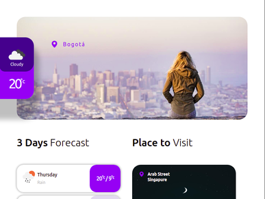
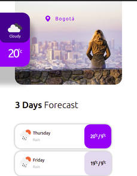

# test-gradiweb Gradiweather
Prueba técnica Gradiweb

Gradiweather es una pequeña app del clima que nos muestra el clima actual de Bogotá, Colombia y el pronóstico de los próximos 3 días. También nos da el clima actual de Paris, Francia.

## API
Consumimos la siguiente API: [API](https://openweathermap.org/current)

## Tecnologías
- ReactJs
- SASS
- Webpack
- Babel
- Travis CI

## Screenshots

   ### Desktop
   
   ### Tablet
   
   ### Mobile
   

## Página
   [Gradiweather](https://gradiweather.netlify.app/)

## Autor
   Daniel Santos
   2021/02/03

## Instalación
```
   npm install
```

## Ejecución
```
   npm run dev
```

## Compilar
```
   npm run build
```

